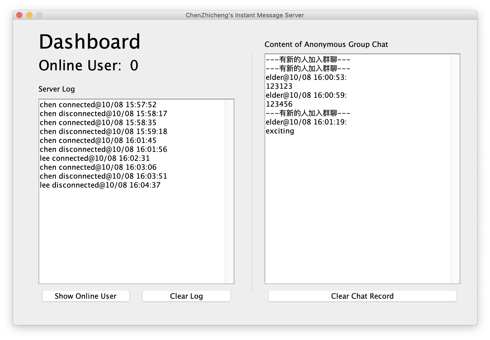
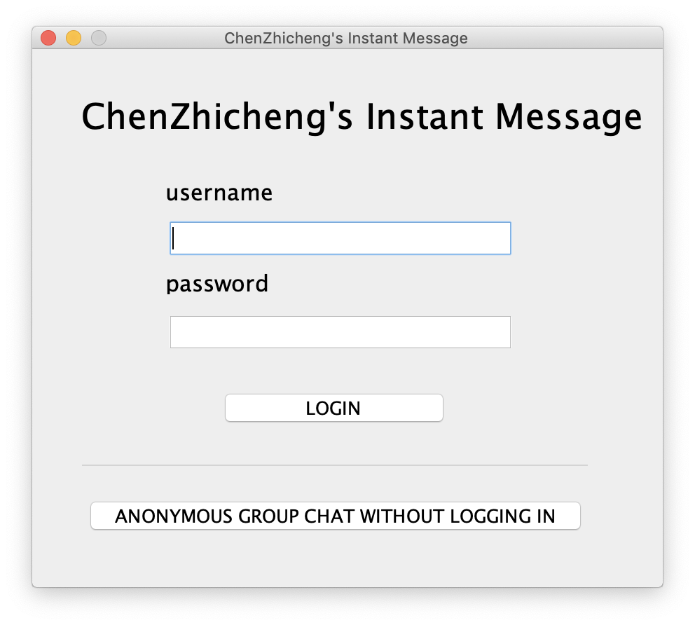
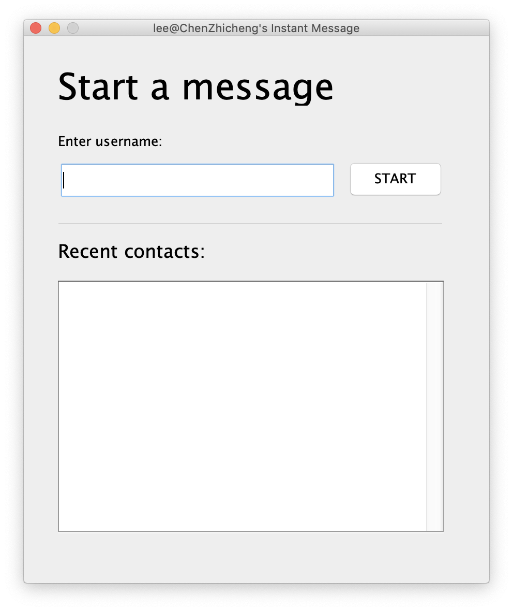
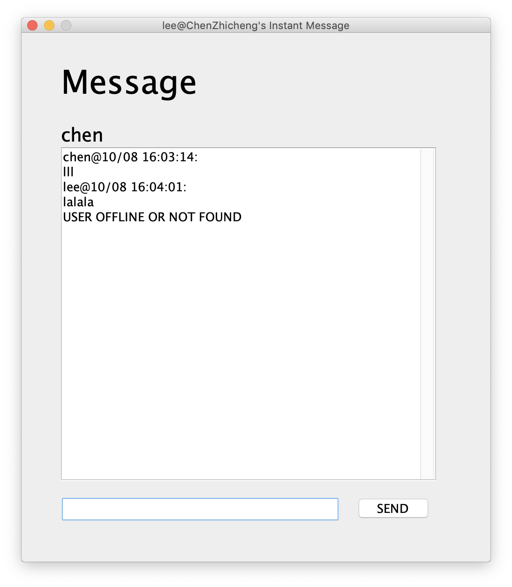
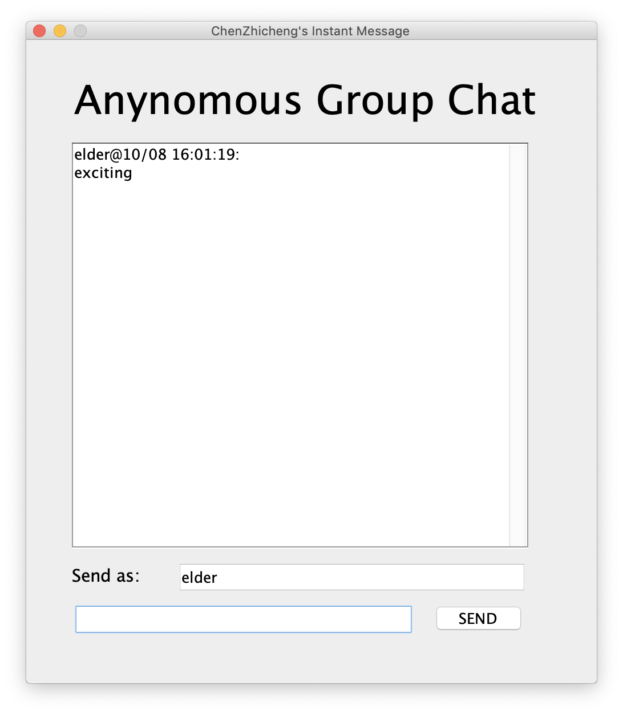

# CIM

## Overview

用来应付计算机网络以及java的课程项目的一个简陋的的聊天软件。

A simple chat software which is used to dealing with computer networks and Java course projects.

## Introduction

简单的来说有大概这样几个功能

* 用户名密码登陆

* 使用TCP协议实现的一个点对点的聊天

* 使用UDP协议实现的匿名群聊

### Server

给server端简单画了一个UI，能够显示在线人数，登入登出状态还有匿名群聊的内容

### Client

登陆界面，使用username和password登陆或者在不登陆的情况下使用匿名群聊

开始聊天的界面，输入用户名开始聊天，近期联系人将显示在下方

正经的聊天界面

以及匿名聊天界面

## Todo（并不会做）

* IP地址以及端口等信息还是硬编码在代码中

* 服务器端验证用户名密码部分还跟没有一样（其实就是没有）

* 代码还是跟一坨屎一样，需要重构

* 使用maven或者是gradle管理项目
